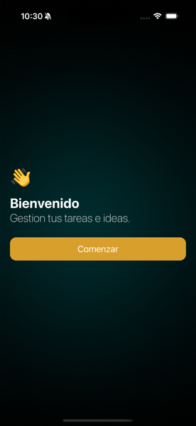
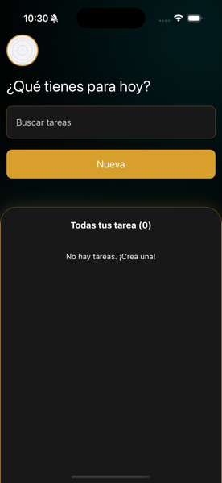
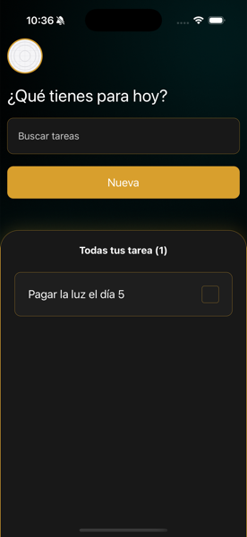
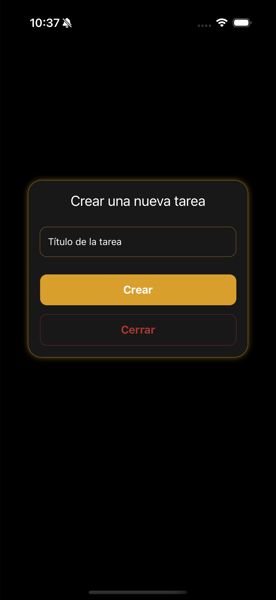
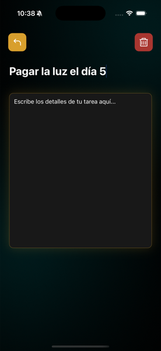

# TodoList Challenge - Prueba Técnica

Una aplicación de lista de tareas (Todo List) desarrollada como prueba técnica, implementada con FastAPI para el backend y React Native (Expo) para el frontend móvil.

## Arquitectura del Proyecto

El proyecto está dividido en dos partes principales:

### Backend (`/backend`)

- **Framework**: FastAPI
- **Lenguaje**: Python 3.12+
- **Base de datos**: PostgreSQL (usando psycopg2)
- **Gestión de dependencias**: Poetry

### Frontend (`/frontend`)

- **Framework**: React Native con Expo
- **Lenguaje**: TypeScript
- **Navegación**: React Navigation
- **Estado**: TanStack Query (React Query)
- **HTTP Client**: Axios

## Demo

A continuación se muestran capturas de pantalla de la aplicación:

### Pantalla de Onboarding



### Pantalla Principal - Home





### Crear Nueva Tarea



### Detalle de Tarea



## Instalación y Ejecución

### Backend

```bash
cd backend
poetry install
poetry run uvicorn main:app --reload
```

### Frontend

```bash
cd frontend
npm install
npm start
```

## Tecnologías Utilizadas

**Backend:**

- FastAPI
- Pydantic
- PostgreSQL
- Uvicorn

**Frontend:**

- React Native
- Expo
- TypeScript
- TanStack Query
- React Navigation

## Autor

**Dalvin Segura** - [hello@dalvin.site](mailto:hello@dalvin.site)
